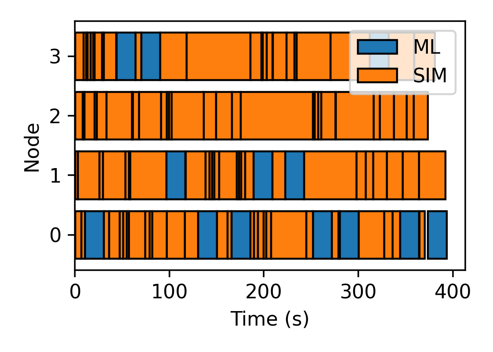

# Dynamically Re-allocating Resources

Supercomputing applications operate with a fixed amount of computing resources.
We anticipate future applications will require re-allocating these resources between
different tasks as more data is collected.
Here, we demonstrate a simple example of the resource management mechanism in Colmena.

## Application Description
We build an example optimization application where we periodically reduce the number of simulations 
run in parallel to dedicate resources towards re-prioritizing the list of simulations.

The "simulation" tasks evaluate the Ackley Function at specified points and the ML tasks 
train a Gaussian Process Regression model before using it to rank points based on their 
expected improvement value.

The application is configured to launch the machine learning task after a fixed number 
of new simulations have completed.

*Example utilization*

## Implementation

We divide the application into three threads: simulation submitter, simulation receiver, and thinker.
The threads communicate data between them using a shared database (a Python dictionary),
a task queue, and a "resource tracker" (see [Colmena Docs](https://colmena.readthedocs.io/en/latest/source/colmena.thinker.html#module-colmena.thinker.resources>)).

The allocation states with an empty database, a task queue filled with tasks in a random order,
and all resources dedicated to simulation tasks.

*Submitter*: The submitter waits for resources to become available for simulation tasks and then submits 
the next task on the task queue.

*Receiver*: Receives simulation results. 
Receiving a result triggers the thread to mark resources as available for simulation tasks and
then add the result to the database.

*Thinker*: Waits until the database increases to a certain size before running an ML task to determine a better order
for the task queue.
Once the database reaches the target size, requests resources to be re-allocated from simulation to machine learning
then submits a task to train a Gaussian process regression model and run inference on the remaining tasks in the
task queue to determine which have the largest "expected improvement" over the current optimum.
The results from this task are used to reorder the task queue.
Once the task queue is reordered, the thinker reallocates its resources back to the pool for simulation tasks
and waits again for the database to increase by a specified size.
