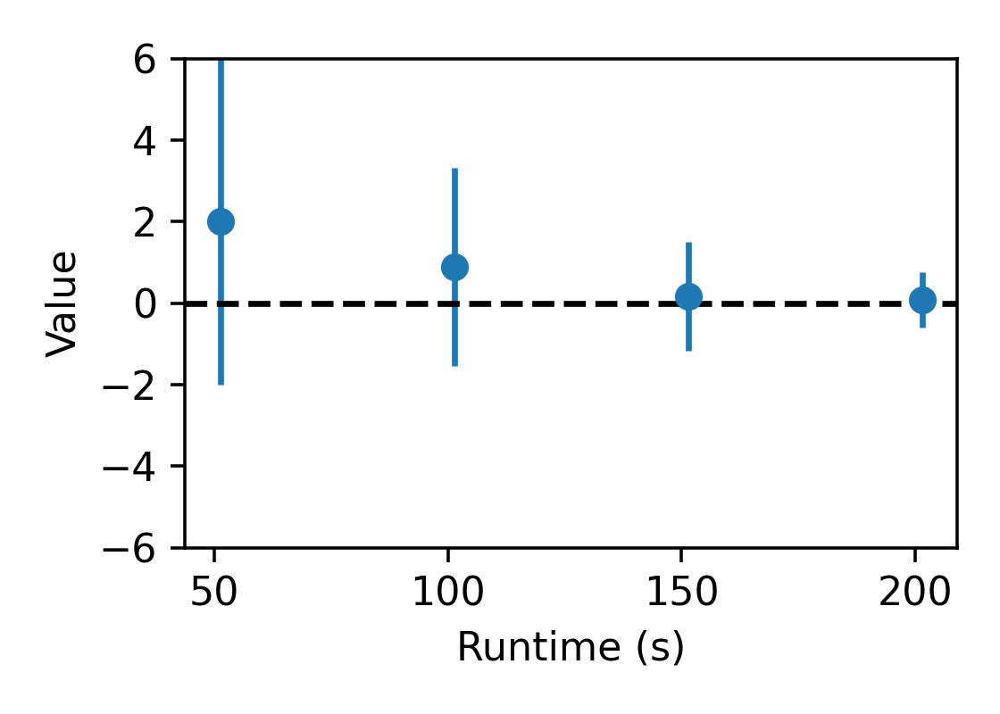
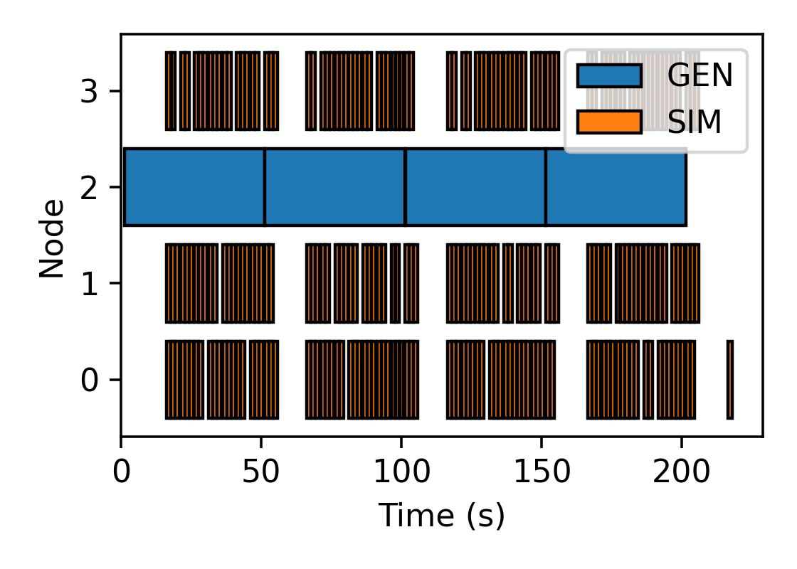

# Streaming Methods

Colmena supports sending yielded results from Python generator functions to the thinker before the entire
function completes.
This example shows an application which implements a "run the most-recent task" policy.

See [Colmena's documentation](https://colmena.readthedocs.io/en/latest/methods.html#generator-python-functions)
for further details.

## Example Problem

This application tries to find the maximum of $f(x) = 4 - x^2$ by training a generative model which mimics 
the distribution of the best-performing entries so far.

The generative model is simple: it produces a sample of entries from the normal distribution each training batch
and then updates the mean and standard deviation of the distribution to be closer to those of the 
best entries in the training batch.
The incremental learning approach used here is a proxy for more complicated learning algorithms.

We start our generator with a mean of 2 and standard deviation of 4 and observe 
that it drifts towards the correct mean of 0 over time.

## Scheduling Policy

Tasks which train the generator run continuously.
Each task streams the training batches back to the trainer at each batch,
and returns the updated weights (mean, std dev) of the generator at the end
of each computation.
The top-performing examples are submitted to the generator for the next training task,
yielding better generated samples over time.

The simulation tasks run on the most recent samples produced by the generator
as soon as any are available.

