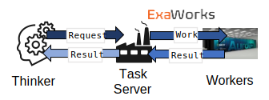

Design
======

Colmena is a library on which you can build other applications and
is not a tool for steering ensembles of simulations on its own.
This portion of the documentation discuss the components of Colmena
and illustrate how they work together.

Key Concepts
------------

Applications based on Colmena are typically composed of two separate processes:
a "Thinker" application and a "Doer" application.
The "Thinker" application determines the computations to perform and
communicates specifications to the "Doer."
These computations can consist of both the target simulations to be
performed (e.g., a DFT code) *and* computations used to decide which
simulation to perform next (e.g., training and inference of a machine-learned
surrogate model).

.. image:: _static/overview.svg
    :height: 200px
    :align: center

"Thinker": Active Learning Agent
++++++++++++++++++++++++++++++++

The "Thinker" process is responsible for generating tasks to send to the Method server.
Colmena supports many different kinds of task generation methods each with
different concurrency and optimization performance tradeoffs.
For example, one could develop a batch optimization algorithm
that waits for every simulation in a batch to complete before
sending deciding new simulations or a streaming optimization
tool that continuously maintains a queue of new computations.

"Doer": Method Server
+++++++++++++++++++++

The "Doer" server accepts tasks specification, deploys tasks on remote services
and sends results back to the Thinker agent(s).
The "Doer" process also stores information about available
methods including task descriptions (e.g., a DAG representation of a workflow)
and supports updating that task descriptions on request
(e.g., updating to a latest version of a machine learning model).

Communication
+++++++++++++

Communication between the "Thinker" and "Doer" is asynchronous
and follows a very specific pattern.
"Thinker" applications make requests to the method server for computations
and receive the results in no particular order.

.. Need to check my nomenclature with a distributed computing person

Implementation
--------------

Our current implementation of Colmena is based around a Parsl workflow
engine to manage computations and Redis for asynchronous communication.

.. Do I need to make a section on how we use Redis and Parsl?

Client
++++++

The "Thinker" process, which we refer to as the client,
in a Colmena application is custom software developed to
decide which tasks are run.

The client communicates by either writing *task requests* to or reading *results* from
Redis queues.
Tasks and results are communicated as JSON objects and contain the inputs to a task,
the outputs of the task, and a variety of profiling data (e.g., task runtime,
time inputs received by method server).
We provide a Python API for the message format, :class:`colmena.models.Result`, and
interfacing with the Redis queues, :mod:`colmena.redis`, but the code can be
written in any language.

Method Server
+++++++++++++

We implement a method server based on `Parsl <https://parsl-project.org>`_.
Parsl provides a model of distributed computing in Python that meshes well with
Python's native :mod:`concurrent.futures` module and allows for users to express complex
workflows in Python.
We create :class:`parsl.app.PythonApp` for each of the methods available in the method server,
which allows us to use them as part of Parsl workflows and execute them on distributed resources.

The :class:`colmena.method_server.ParslMethodServer` itself is a multi-threaded Python application:

1. *Intake Thread*: The intake thread reads task requests from the input Redis queue(s), deserializes
   them and submits the appropriate tasks to Parsl. Submitting a task to Parsl involves calling
   the ``PythonApp`` for a certain method defined in the input specification and creating a workflow
   such that the result from the method will be sent back to the queue.
2. *Parsl Threads*: Parsl is a multi-threaded application which handles launching and communicating
   with worker processes. These workers can reside on other systems (e.g., compute or launch nodes on HPC).
3. *Output Threads*: Each task is defined as a two-step workflow in Parsl: "perform task" followed by
   "output results". The "output task" step in the workflow is performed on a collection of threads
   managed by Parsl.
4. *Error Collection Thread*: Tasks which fail to run are periodically sent back to the client
   over the Redis queue. The Error thread captures errors reported from Parsl and adds them to the Redis queue.

Life-Cycle of a Task
--------------------

We describe the life-cycle of a task to illustrate how all of the components of Colmena work together
by illustrating a typical :class:`colmena.models.Result` object.

.. code-block:: json
    :linenos:

    {
        "inputs": [[1, 1], {"operator": "add"}],
        "method": "reduce",
        "value": 2,
        "success": true,
        "time_created": 1593498015.132477,
        "time_input_received": 1593498015.13357,
        "time_compute_started": 1593498018.856764,
        "time_running": 1.8e-05,
        "time_result_sent": 1593498018.858268,
        "time_result_received": 1593498018.860002
    }

**Launching Tasks**: A client creates a task request at ``time_created`` and adds the the input
specification (``method`` and ``inputs``) to an "outbound" Redis queue. The task request is formatted
in the JSON format defined above with only the ``method``, ``inputs`` and ``time_created`` fields
populated.

**Task Routing**: The method server reads the task request from the outbound queue at ``time_input_received``
and submits the task to the distributed workflow engine.

**Computation**: A Parsl worker starts a task at ``time_compute_started``, which requires ``time_running``
and sends the result back to the Method server.

**Result Communication**: The method server adds the result to the task specification (``value``) and
sends it back to the client in an "inbound" queue at ``time_result_sent``.

**Result Retrieval**: The client retrieves the message from the inbound queue at ``time_result_received``.

The overall efficiency of the task system can be approximated by comparing the ``time_running``, which
denotes the actual time spent executing the task on the workers, to the difference between the ``time_created``
and ``time_returned`` (i.e., the round-trip time).
Comparing round-trip time and ``time_running`` captures both the overhead of the system and any time
waiting in a queue for other tasks to complete and must be viewed carefully.

The overhead specific to Colmena (i.e., and not Parsl) can be measured by assessing the communication time
for the Redis queues.
For example, the inbound queue can be assessed by comparing the ``time_created`` and ``time_input_received``.
The communication times for Parsl can be measured only when the queue length is negligible
through the differences between ``time_inputs_received`` and ``time_compute_started``.
