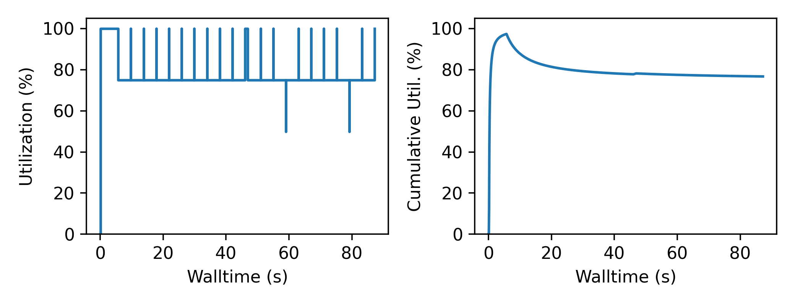
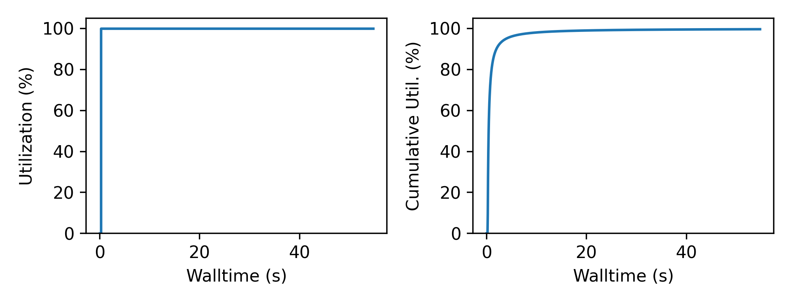

Building a Colmena Application
==============================

Creating a new application with Colmena involves defining a "tasks server" to
that deploys expensive functions and a "thinker" application that
decides which tasks to submit.
We describe each topic separately.

See `Design <./design.html>`_ for details on Colmena architecture.

Configuring a Task Server
-------------------------

The task server for Colmena is configured with the list of methods, a
list available computational resources and a mapping of which methods
can use each resource.

We describe the :class:`colmena.task_server.ParslTaskServer` in this document,
although `more are available <task-servers.html>`_.

Defining Methods
++++++++++++++++

Methods in Colmena are defined as Python functions.
Any Python function can be served by Colmena, but
there are several limitations in practice:

1. *Functions must be serializable.* We recommend defining functions in Python
   in the script that creates the task server or in modules that are accessible
   from the Python Path (e.g., part of packages installed with ``pip``)
2. *Inputs must be serializable.* Parsl makes a best effort to serialize function
   inputs with JSON, Pickle and other serialization libraries but some object types
   (e.g., thread locks) cannot be serialized.
3. *Functions must be pure.* Colmena is designed with the assumption that the order
   in which you execute tasks does not change the outcomes.

Common Example: Launching MPI Applications
~~~~~~~~~~~~~~~~~~~~~~~~~~~~~~~~~~~~~~~~~~

We imagine many Colmena applications will define methods that
require launching an external executable that runs on more than one node.
Our recommended pattern for using MPI applications is to write a single Python function
that handles writing inputs, launching the function and parsing outputs:

.. code-block:: python

    from subprocess import run
    from tempfile import TemporaryDirectory
    import os

    def mpi_method(inputs, num_nodes=2, ranks_per_node=4):
        """Run an MPI application

        Args:
            inputs (Any): Inputs to MPI application
            num_nodes (int): Number of nodes to use for application
            ranks_per_node (int): Number of ranks per node
        Returns:
            (Any) Output from the function
        """

        # Create a temporary directory for the files
        #  (assumed to be visible on the global filesystem)
        with TemporaryDirectory() as td:
            # Make the input file
            in_file = os.path.join(td, 'input.file')
            with open(in_file, 'w') as fp:
                print(inputs, file=fp)

            # Make the path to the output file
            out_file = os.path.join(td, 'out.file')

            # Launch the application
            with open(out_file, 'w') as fp:
                run([
                    'aprun', '-n', str(num_nodes * ranks_per_node), '-N', str(ranks_per_node),
                    '/path/to/mpi_application', in_file
                ], stdout=fp)

            # Parse the outputs and return the answer
            with open(out_file) as fp:
                return int(re.match('Answer: (\d+)', fp.read()).group(1))

This basic pattern has many points for further optimization that could be critical for some applications:

1. *System-specific mpiexec command*. We hard code here for simplicity, but consider a configuration file system
   like `QCEngine <http://docs.qcarchive.molssi.org/projects/QCEngine/en/latest/environment.html#configuration-files>`_
   or passing a function for making the call as an argument.
2. *Leaving Compute Nodes Idle*: The compute nodes are idle while generating the input file(s) based on the
   input arguments and parsing the output. If writing inputs and parsing output are expensive,
   consider using separate methods to pre- and postprocessing. We are planning to streamline this process in
   the future (see `Issue #4 <https://github.com/exalearn/colmena/issues/4>`_).

.. note::

    We are considering an improved model where the pre- and post-processing methods can
    be separate tasks to avoid holding on to large number of nodes
    during pre- or post-processing (see `Issue #4 <https://github.com/exalearn/colmena/issues/4>`_).

Specifying Computational Resources
++++++++++++++++++++++++++++++++++

Colmena uses `Parsl's resource configuration <https://parsl.readthedocs.io/en/stable/userguide/configuring.html>`_
to define available resources for Colmena methods.
We use an complex example that specifies running a mix of single-node and multi-node tasks on
`Theta <https://www.alcf.anl.gov/support-center/theta>`_  to illustrate:

.. code-block:: python

    from parsl.addresses import address_by_hostname
    from parsl.config import Config
    from parsl.executors import HighThroughputExecutor, ThreadPoolExecutor
    from parsl.launchers import AprunLauncher, SimpleLauncher
    from parsl.providers import LocalProvider

    example_config = Config(
        executors=[
            ThreadPoolExecutor(
                label="multi_node",
                max_threads=8
            ),
            HighThroughputExecutor(
                address=address_by_hostname(),
                label="single_node",
                max_workers=2,
                provider=LocalProvider(
                    nodes_per_block=2,
                    init_blocks=1,
                    max_blocks=1,
                    launcher=AprunLauncher('-d 64 --cc depth'),  # Places worker on compute node
                    worker_init='''
    module load miniconda-3
    export PATH=~/software/psi4/bin:$PATH
    conda activate /lus/theta-fs0/projects/CSC249ADCD08/colmena/env
    ''',
                ),
            )
        ],
        strategy=None,
    )

The overall configuration is broken into two types of "executors:"

``multi_node``
  The ``multi_node`` executor provides resources for applications that use multiple nodes.
  We use the ``ThreadPoolExecutor`` to run the pre- and post-processing Python code
  on the same Python process as the task server, which can save significant computational resources.
  The maximum number of tasks being run on this resource is defined by ``max_workers``.
  Colmena users are responsible for providing the appropriate ``mpirun`` invocation in methods
  deployed on this resource and for controlling the number of nodes used for each task.

``single_node``
  The ``single_node`` executor handles tasks that do not require inter-node communication.
  Parsl places workers on two nodes (see the ``nodes_per_block`` setting) with the ``aprun``
  launcher, as required by Theta. Each node spawns 2 workers and can perform
  two tasks concurrently.

Note that we use ``LocalProvider`` classes to define how Parsl accesses resources.
The :class:`parsl.providers.LocalProvider` class assumes that resources are already
accessible to the application in contrast to providers like
:class:`parsl.providers.CobaltProvider` that request resources
on behalf of the application (e.g., from an HPC job scheduler).

Mapping Methods to Resources
++++++++++++++++++++++++++++

The constructor of :class:`colmena.task_server.ParslTaskServer` takes a list of
Python function objects as an input.
Internally, the task server converts these to Parsl "apps" by calling
:py:func:`python_app` function from Parsl.
You can pass the keyword arguments for this function along with each function
to map functions to specific resources.

For example, the following code will place requests for the "launch_mpi_application"
method to the "multi_node" resource and the ML task to the "single_node" resource:

.. code-block:: python

    server = ParslTaskServer([
        (launch_mpi_application, {'executor': 'multi_node'}),
        (generate_designs_with_ml, {'executor': 'single_node'})
    ])

Creating a "Thinker" Application
--------------------------------

Colmena is designed to support many different algorithms for creating tasks and
responding to results.
Such "thinking" applications take the form of threads that send and receive results
to/from the task server(s) using the Redis queues.
Colmena provides as :class:`colmena.thinker.BaseThinker` class to simplify creating
multi-threaded applications.

Working with ``BaseThinker``
++++++++++++++++++++++++++++

Creating a new ``BaseThinker`` subclass involves defining different "agents"
that interact with each other and the task server.
The class itself provides a template for defining information shared between agents
and a mechanism for launching them as separate threads.

A minimal Thinker is as follows:

.. code-block:: python

    class Thinker(BaseThinker):

        @agent
        def operation(self):
            self.queues.send_inputs(4)
            result = self.queues.get_result()
            self.output = result.value

    thinker = Thinker(queues)
    thinker.run()
    print(f'Simulation result {result.value}')

The example shows us a few key concepts:

1. You communicate with the task server using ``self.queues``, which provides
   `a wrapper over the Redis queues <https://colmena.readthedocs.io/en/latest/source/colmena.redis.html#colmena.redis.queue.ClientQueues>`_.
2. Operations within the a Thinker are marked with the ``@agent`` decorator.
3. Calling ``thinker.run()`` launches all agent threads within that class
   and runs until all complete.

Submitting Tasks
~~~~~~~~~~~~~~~~

:class:`colmena.redis.queue.ClientQueues` provides communication to the task server
and is available as the ``self.queues`` class attribute.

Submit requests to the task server with the ``send_inputs`` function.
Besides the input arguments and method name, the function also accepts a
"topic" for the method queue used when filtering the output results.

The ``get_result`` function retrieves the next result from the task server
as a :class:`colmena.models.Result` object.
The ``Result`` object contains the output task and the performance information
(e.g., how long communication to the client required).
``get_result`` accepts a "topic" to only pull tasks sent with a certain topic to the queue.

Inter-agent Communication
~~~~~~~~~~~~~~~~~~~~~~~~~

Agents in a thinking application are run as separate Python threads.
Accordingly, you can share objects between agents.
We recommend versing yourself in Python's rich library of
`threading objects <https://docs.python.org/3/library/threading.html>`_
and `queue objects <https://docs.python.org/3/library/queue.html>`_
to communicate information between agents.

Example Applications
++++++++++++++++++++

We will describe a few example explanations to illustrate how to make a Thinker applications
that implement degrees of overlap between performing simulations and selecting the next simulation.

For all of these cases, we provide a simple demonstration application in
`the demo applications <https://github.com/exalearn/colmena/tree/master/demo_apps/optimizer-examples>`_.

Batch Optimizer
~~~~~~~~~~~~~~~

*Source code*: `batch.py <https://github.com/exalearn/colmena/blob/master/demo_apps/optimizer-examples/batch.py>`_

A batch optimization process repeats two steps sequentially: select a batch of simulations and 
then perform every simulation in the batch.
Batch optimization, while simple to implement, can lead to poor utilization
if there is a large variation between task completion times (see discussion by
`Wozniak et al. <http://dx.doi.org/10.1186/s12859-018-2508-4>`_).

.. figure:: _static/batch-utilization.png
    :width: 75%
    :align: center
    :alt: Utilization over time for batch optimizer

    Resources remain unused while waiting for all members of a batch to complete.

The core logic for each loop can be expressed using a single thread communicating
with a single task queue:

.. code-block:: python

    while not stop_condition:
        # Use the current state of the optimizer to choose new tasks
        tasks = generate_tasks(database, batch_size)

        # Send out tasks on the input queue
        for task in tasks:
            queues.send_inputs(task, method="simulate")

        # Collect the tasks, and update the database
        for _ in range(batch_size):
            result = queues.get_result()

            # Save the inputs (args) and output (value)
            database.append((results.args, results.value))

Streaming Optimizer
~~~~~~~~~~~~~~~~~~~

*Source code*: `streaming.py <https://github.com/exalearn/colmena/blob/master/demo_apps/optimizer-examples/streaming.py>`_

A streaming or "on-line" optimizer selects a new task immediately after any task completes.
The streaming optimizer is particularly beneficial when the time to select a new task
is much shorter than the rate at which new tasks complete.
As evidenced by codes such as `Rocketsled <https://hackingmaterials.lbl.gov/rocketsled/>`_,
streaming optimizers are an excellent choice for lengthy tasks run with modest batch sizes.
However, the utilization of a computational resource can break down when the rate of task
completion becomes comparable to the rate at which new tasks can be generated.

.. python streaming.py --runtime 2 --runtime-var 0.5 --opt-delay 4 --num-guesses 20

    Utilization limited by task generation rate

A streaming optimizer can also be realized by a single Thinker process and a single
task queue.

.. code-block:: python

    # Create as many parallel tasks as worker slots
    tasks = generate_tasks(database, batch_size)
    for task in tasks:
        queues.send_inputs(task, method="simulate")

    # As new tasks complete immediately generate a single new task
    while not stop_condition:
        # Wait until a task completes, pull it from queue
        result = queues.get_result()

        # Add it to the database
        database.append((results.args, results.value))

        # Generate a new task, using the latest results
        task = generate_tasks(database, 1)[0]

        # Sent new task to the queue
        queues.send_inputs(task, method="simulate")

Interleaved Optimizer
~~~~~~~~~~~~~~~~~~~~~

*Source code*: `interleaved.py <https://github.com/exalearn/colmena/blob/master/demo_apps/optimizer-examples/interleaved.py>`_

An "interleaved" optimizer continually updates a queue
of next simulations while new simulations are running.
A new task is started from a task queue as soon as a simulation task completes.
The task queue is maintained by a separate thread that continually updates
the task generator and re-prioritizes the task queue.
Full system utilization can be achieved as long as the task queue is sufficiently long.
The challenge instead is to minimize the time between new data received
and the task queue being updated with this new data.

    Caching a prioritized list of tasks prevents under-utilization

Creating an interleaved optimizer in Colmena can be achieved best using two separate
threads that each use their own task queues.

The first thread is a simulation dispatcher.
It shares a task list, result database, and a `Lock <https://docs.python.org/3/library/threading.html#lock-objects>`_
with the other thread.
We use an `Event <https://docs.python.org/3/library/threading.html#event-objects>`_, ``done``,
to signal both threads that the optimization loop has completed.
We denote tasks associated the simulation dispatcher with the topic "doer."

.. code-block:: python

    # Send out the initial tasks
    for _ in range(batch_size):
        queues.send_inputs(task_queue.pop(), method='simulate', topic='doer')

    # Pull and re-submit
    while not done.is_set():
        # Get a result
        result = queues.get_result(topic='doer')

        # Immediately send out a new task
        with queue_lock:
            queues.send_inputs(task_queue.pop(), method='simulate', topic='doer')

        # Add the old task to the database
        database.append((result.args, result.value))

The second thread is a task generator and prioritizer.
Its tasks are labeled with the "thinker" topic.

.. code-block:: python

    # Create some tasks
    tasks = generate_tasks(database, queue_length)

    while not done.is_set():
        # Send out an update task, which generates
        #  a new priority order for the tasks
        with queue_lock:
            queues.send_inputs(database, tasks,
                               method='reprioritize_queue',
                               topic='thinker')

        # Wait until it is complete
        result = queues.get_result(topic='thinker')
        new_order = result.value

        # Update the queue (requires locking)
        with queue_lock:
            # Copy out the old values
            current_queue = task_queue.copy()
            task_queue.clear()

            # Note how many of the tasks have been started
            num_started = len(new_order) - len(current_queue)

            # Compute the new position of tasks
            #  Noting that the first items in the queue are gone
            new_order -= num_started

            # Re-submit tasks to the queue
            for i in new_order:
                if i < 0:  # Task has already been sent out
                    continue
                task_queue.append(current_queue[i])

Creating a ``main.py``
----------------------

The script used to launch a Colmena application must create the Redis queues and
launch the task server and thinking application.

A common pattern is as follows:

.. code-block:: python

    from colmena.task_server import ParslTaskServer
    from colmena.redis.queue import make_queue_pairs

    if __name__ == "__main__":
        # [ ... Create the Parsl configuration, list of functions, ... ]

        # Generate the queue pairs
        client_queues, server_queues = make_queue_pairs('localhost', serialization_method='json')

        # Instantiate the task server and thinker
        task_server = ParslTaskServer(functions, server_queues, config)
        thinker = Thinker(client_queues)

        try:
            # Launch the servers
            doer.start()
            thinker.start()

            # Wait for the thinking application to complete
            thinker.join()
        finally:
            # Send a shutdown signal to the task server
            client_queues.send_kill_signal()

        # Wait for the task server to complete
        doer.join()

The above script can be run as any other python code (e.g., ``python run.py``)
once you have started Redis (e.g., calling ``redis-server``).

We have described configuration options for task server and thinker applications earlier.
The key options to discuss here are those of the communication queues.

The :meth:`colmena.redis.queue.create_queue_pairs` function creates Redis queues with matching options
for the thinking application (client) and task server.
These options include the network address of the Redis server,
a list of "topics" that define separate queues for certain types of tasks,
and a few communication options, such as:

- ``serialization_method``: Whether to use JSON or Pickle to serialize inputs and outputs.
  Either may produce smaller objects or provide faster conversion depending on your data types.
- ``keep_inputs``: Whether to retain inputs in ``Result`` object after task has completed.
  Removing inputs could speed communication but may complicate debugging.

