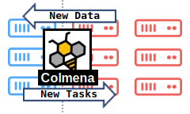

Colmena: AI-Steering for HPC
============================

Colmena is a Python library for building applications
that combine AI and simulation workflows on HPC.
Its core feature is a communication library that simplifies
tools for intelligently steering large ensemble 
simulations.

Colmena open-source and available on GitHub: https://github.com/exalearn/colmena

What does Colmena do?
---------------------

The core concept of Colmena is a "thinking" application. 
The Thinking application is responsible for intelligently 
responding to new data, such as by updating a machine learning 
model or selecting a new simulation with Bayesian optimization.

Colmena provides a few main components to enable building thinking applications:

    #. An extensible base class for building thinking applications with a dataflow-like programming model
    #. A "Task Server" that provides a simplified interface to HPC-ready workflow systems
    #. A high-performance queuing system communicating to tasks servers from thinking applications

The `demo applications <https://github.com/exalearn/colmena/tree/master/demo_apps/optimizer-examples>`_
illustrate how to implement different thinking applications that solve optimization problems.

.. toctree::
   :maxdepth: 2
   :caption: Contents:

   installation
   quickstart
   design
   how-to
   thinker
   methods
   task-servers
   queues
   examples
   source/modules

Why the name "Colmena?"
-----------------------

Colmena is Spanish for "beehive."
Colmena applications, like their namesake,
feature independent agents that perform a variety
of tasks over their lifetimes without complicated
communication between each other.

Citing Colmena
--------------

Please cite our 2024 paper if you use Colmena in a research paper:
`link <https://doi.org/10.1177/10943420241288242>`_
`bibtex <https://www.doi2bib.org/bib/https://doi.org/10.1177/10943420241288242>`_

Indices and tables
------------------

* :ref:`genindex`
* :ref:`modindex`
* :ref:`search`
