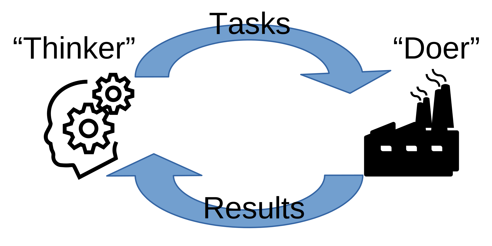

Quickstart
==========

A short introduction to building a Colmena app.

For this exercise, our goal is to find a point that minimizes :math:`f(x) = x^2`
using a simple search algorithm: pick a new point within ±0.5 from minimum so far.

This tutorial will explain our
`multi-agent-thinker.py <https://github.com/exalearn/colmena/blob/master/demo_apps/multi-agent-thinker.py>`_
demo application.

0. Write functions
------------------

Translating our target function, *f(x)*, and search algorithm into Python yields:

.. code-block:: python

    def target_function(x: float) -> float:
        return x ** 2


    def task_generator(best_to_date: float) -> float:
        from random import random
        return best_to_date + random() - 0.5

1. Define Communication
------------------------------



Colmena applications are split into a "thinker" application generates tasks that are executed
on remote resources.
The two applications communicate via Redis queues.

First, launch redis in the background: ``redis-server``

We setup the Redis queues in Python using Colmena's "queue building" function:

.. code-block:: python

    client_queues, server_queues = make_queue_pairs('localhost', topics=['generate', 'simulate'])

This command connects to a server on localhost and creates separates queues for simulation and task
generation results.

Using the Value Server
++++++++++++++++++++++

Colmena uses `ProxyStore <https://github.com/gpauloski/ProxyStore>`_ to implement a Redis-based value server.
The value server can be used to efficiently transfer large objects, typically on the order of 100KB or larger, between the thinker and workers directly.
To enable the value server, a threshold value (bytes) can be passed via the parameter :code:`value_server_threshold` to :code:`make_queue_pairs`.
Any input/output object of a target function larger than :code:`value_server_threshold` will be automatically passed via the value server.

By default, the value server uses the Redis server passed to :code:`make_queue_pairs`.
An alternative Redis server for the value server can be specified via the :code:`value_server_hostname` and :code:`value_server_port` parameters of :code:`make_queue_pairs`.

2. Build a method server
------------------------

The "method server" in Colmena distributes request to run functions across distributed resources.
We create one by defining a list of functions and the resources to run them across.

Colmena uses `Parsl <http://parsl-project.org/>`_ to manage executing tasks.
Parsl can scale to 1000s of parallel workers and run on HPC or cloud, but we will define
it to only use up to 4 processes on a single machine:

.. code-block:: python

    config = Config(executors=[HighThroughputExecutor(max_workers=4)])

The list of methods and resources are used to define the "method server":

.. code-block:: python

    doer = ParslMethodServer([target_function, task_generator], server_queues, config)

3. Write the thinker
--------------------

Colmena provides a "BaseThinker" class to create steering applications.
These applications run multiple operations (called agents) that send tasks and receive results
from the method server.

Our thinker has two agents that each are class methods marked with the ``@agent`` decorator:

.. code-block:: python

    class Thinker(BaseThinker):

        def __init__(self, queue):
            super().__init__(queue)
            self.remaining_guesses = 10
            self.parallel_guesses = 4
            self.best_guess = 10
            self.best_result = inf

        @agent
        def consumer(self):
            for _ in range(self.remaining_guesses):
                # Update the current guess with the
                result = self.queues.get_result(topic='simulate')
                if result.value < self.best_result:
                    self.best_result = result.value
                    self.best_guess = result.args[0]

        @agent
        def producer(self):
            while not self.done.is_set():
                # Make a new guess
                self.queues.send_inputs(self.best_guess, method='task_generator', topic='generate')

                # Get the result, push new task to queue
                result = self.queues.get_result(topic='generate')
                self.logger.info(f'Created a new guess: {result.value:.2f}')
                self.queues.send_inputs(result.value, method='target_function', topic='simulate')

"Producer" creates new tasks by calling the "task_generator" method (defined with the method server)
and then using that new task as input to the "target_function."

"Consumer" retrieves completed tasks and determines whether to update the best result so far.

A few things to note:

1. Tasks are run as threads and share class attributes (e.g., ``self.best_guess``)
2. The queue takes arguments, method name and topic name as inputs to send a task
3. The ``self.done`` attribute tracks if any thread has completed.
4. The thinker class provides a logger: ``self.logger``

4. Launching the application
----------------------------

The method server and thinker objects are run asynchronously.
Accordingly, we call their ``.start()`` methods to launch them.

.. code-block:: python

    try:
        # Launch the servers
        doer.start()
        thinker.start()
        logging.info('Launched the servers')

        # Wait for the task generator to complete
        thinker.join()
        logging.info('Task generator has completed')
    finally:
        client_queues.send_kill_signal()

    # Wait for the method server to complete
    doer.join()

5. Running the application
--------------------------

Launch the Colmena application by running it with Python: ``python multi-agent-thinker.py``

The application will produce a prolific about of log messages, including:

1. Log items from the thinker that mark the agent which wrote them:

    ``... - thinker.producer - INFO - Created a new guess: 9.51``

2. Messages from the Colmena queue or method server

    ``... - colmena.redis.queue - INFO - Client received a task_generator result with topic generate```

3. Parsl workflow engine status messages

    ``... - parsl.dataflow.dflow - INFO - Task 45 completed``

6. Learning more
----------------

We recommend reading more from our How-To guide next.
With that knowledge in hand, try improving the optimization algorithm from this example.
